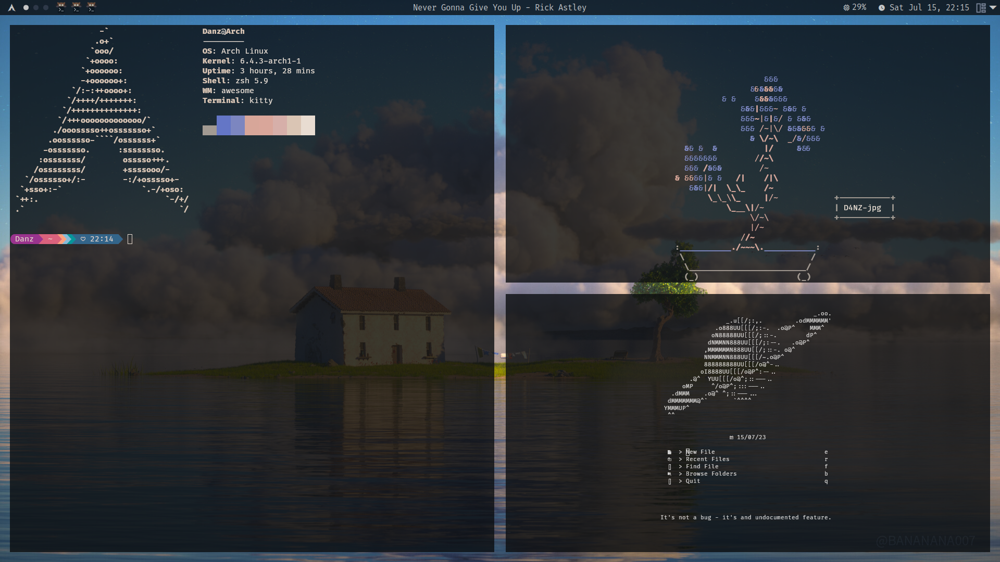

# 🏠 Welcome to My Dotfiles Home! 🌟



👋 Welcome! This humble abode of mine 🚪 (aka my dotfiles) is where I keep all the settings for my favorite tools and apps.

## The Household Members 🧑‍🤝‍🧑🔧

Meet the beloved members of this house, each playing a crucial role in our harmonious household:

- **Hyprland** 🏙️: The cornerstone of my desktop, a Wayland compositor that blends beauty with functionality.
- **Kitty** 🐱: The sleek and fast terminal emulator, where commands and code coexist in harmony.
- **Neovim** 📝: My sanctuary for code, turning every keystroke into a symphony.
- **Zsh** 🐚: The shell that's always ready to greet me, customized for a seamless day-to-day dialogue.
- **Rofi** 🚀: The speedy launcher, opening doors to my applications faster than the blink of an eye.
- **Waybar** 📊: A window to my system's heart, offering customizable notifications and insightful status updates.
- **Wlogout** 🚪🌌: Ensuring each farewell is as smooth and peaceful as a night's slumber.

## Housekeeping 🧹🏠

Managing this digital estate is [chezmoi](https://github.com/twpayne/chezmoi), the behind-the-scenes hero, keeping everything orderly and synchronized.

## Move In 🚚📦

To make yourself at home with these configurations, chezmoi is your first stop. Not in your toolkit yet? The [official installation guide](https://www.chezmoi.io/install) will help you get settled.

Then, plant your flag with this command:

```bash
chezmoi init --apply D4NZ-jpg
```

This will not only fetch the configurations but also trigger a script that automatically installs all necessary software and some additional goodies to enhance your experience. Sit back and watch your new digital home set itself up! 🌟

Welcome aboard! 🎉 You're now part of this vibrant community.

🚨 Warning: The setup script is exclusively designed for Arch Linux and will not function on other operating systems. For users on different OSes, please utilize your OS's package manager to install the necessary tools.

## Renovations and Improvements 🏗️🛠️

This home is a living space, always embracing change and improvement. Keep an eye out for new tools, remodeled features, and the occasional fresh coat of paint. Each visit promises something new and exciting!
