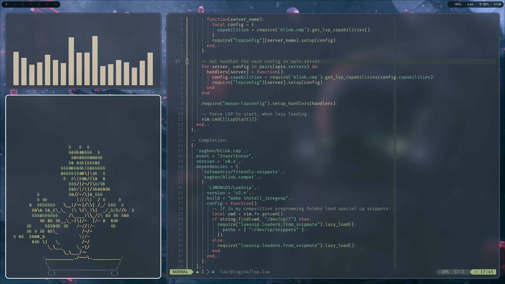

# 🏠 Welcome to My Dotfiles Home!



👋 This humble abode of mine (aka my dotfiles repo) is where I keep all the settings for my favorite tools and apps.

## The Household Members 🧑‍🤝‍🧑
The tools I've configured, each comfortably residing in their own corner of the `~`, are:

- **AwesomeWM**: A window manager that truly lives up to it's name.
- **Neovim**: My text editor of choice, making every line of code a delightful experience.
- **Rofi**: An application launcher that makes launching apps faster than a rocket. 🚀

## Housekeeping 🧹
I manage all these configurations with the help of the trusty [chezmoi](https://github.com/twpayne/chezmoi).

## Move In 🚚
To settle in quickly with these configurations, first make sure chezmoi is 
installed. If it isn't, follow the [official installation guide](https://www.chezmoi.io/install).

Once chezmoi is part of your toolset, just run this command:

```bash
chezmoi init --apply D4NZ-jpg
```

And there you have it! You're now a resident of this humble abode.

## Renovations and Improvements 🏗️
Just like any home, this place is always under a bit of renovation. You'll see 
fresh coats of paint, relocated furniture, and new additions popping up now and 
again. Don't be surprised to find new tweaks and modifications at each visit.
